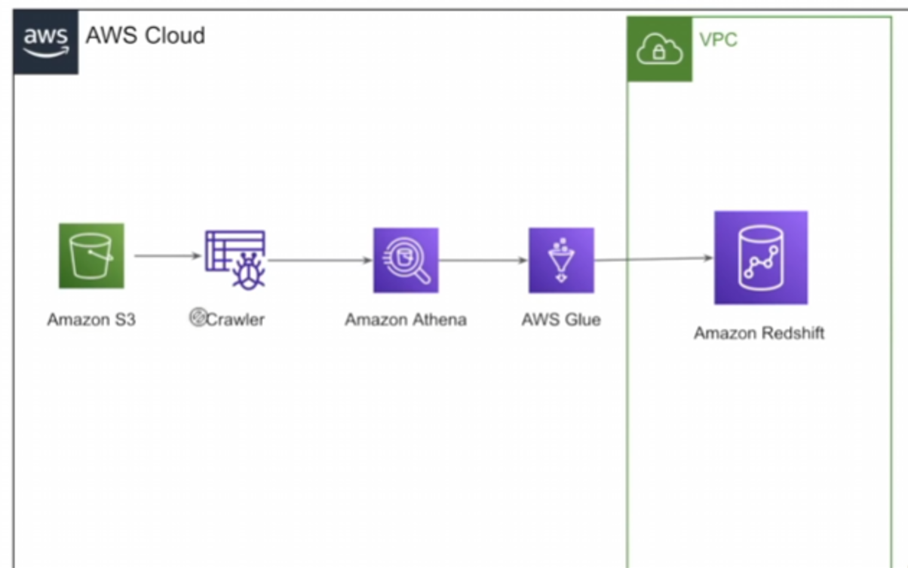
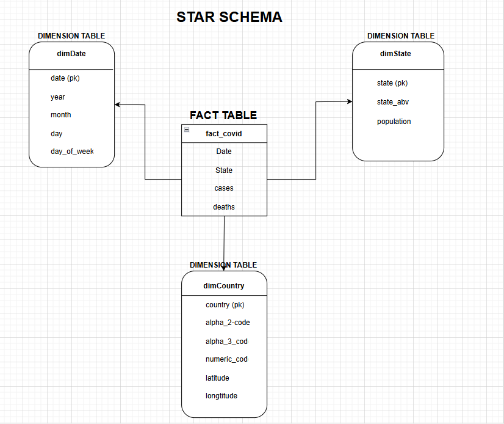
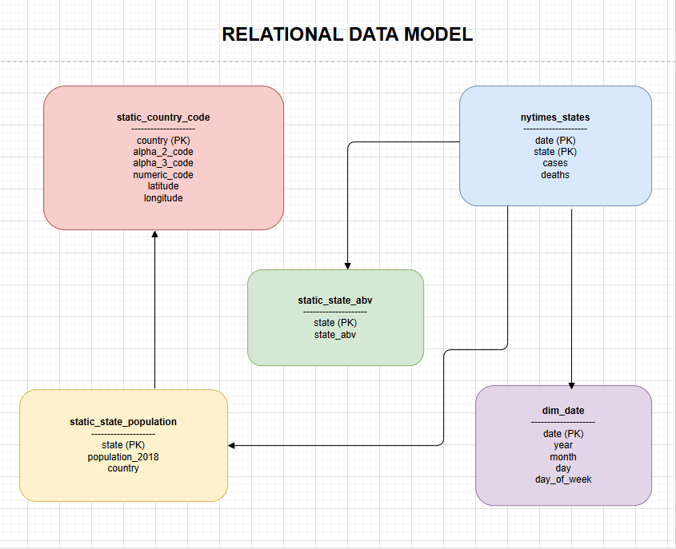

# 🦠 AWS COVID-19 Data Engineering Automation Pipeline

An end-to-end **cloud-native data engineering project** that ingests raw COVID-19 datasets, performs schema discovery and transformations, and loads analytics-ready data into **Amazon Redshift** using a **star schema** for reporting and analysis.

This project demonstrates a **real-world ELT/ETL pipeline** using multiple AWS services with proper security, networking, and automation.

---

## 🚀 Project Overview

The goal of this project is to build a **scalable, automated data pipeline** to:

* Store raw COVID datasets in a data lake
* Query and explore data serverlessly
* Transform data into fact and dimension tables
* Load data into a cloud data warehouse
* Run analytical queries using a star schema

---

## 🏗️ High-Level Architecture

**Data Flow:**

```
Amazon S3 (Raw Data)
        ↓
AWS Glue Crawler (Schema Discovery)
        ↓
Amazon Athena (SQL Exploration)
        ↓
AWS Glue ETL Job (Transformations)
        ↓
Amazon S3 (Processed Data)
        ↓
Amazon Redshift (Data Warehouse)
```

📌 *Architecture Diagram (add screenshot below)*



---

## ☁️ AWS Services Used

### 1️⃣ Amazon S3 (Data Lake)

* Stores **raw COVID-19 datasets** from multiple public sources
* Stores **processed fact and dimension tables** as CSV files

---

### 2️⃣ AWS Glue Crawler

* Automatically scans S3 data
* Infers schema and creates tables in the Glue Data Catalog
* Enables Athena and Glue ETL to work without manual schema definition

---

### 3️⃣ Amazon Athena

* Serverless SQL engine used to:

  * Explore raw datasets directly on S3
  * Validate schema and data quality
* No infrastructure to manage

---

### 4️⃣ AWS Glue ETL Job

* Transforms raw data into analytics-ready format
* Creates **fact and dimension datasets**
* Writes transformed output back to S3

**Key responsibilities:**

* Data cleansing
* Column selection & renaming
* Type standardization
* Fact & dimension table preparation

---

### 5️⃣ Amazon Redshift (Data Warehouse)

* Used as the **analytical data warehouse**
* Stores star-schema modeled tables
* Enables fast analytical queries

**Cluster details:**

* **Node type:** `ra3.large`
* **Region:** `ap-south-1`
* **Purpose:** Analytical workloads & SQL reporting

---

### 6️⃣ IAM (Security & Access Control)

* IAM Role used for **Redshift ↔ S3 COPY operations**
* Fine-grained permissions for:

  * S3 access
  * Glue execution
  * Redshift loading

---

### 7️⃣ Amazon VPC (Networking)

* Glue job runs inside the **same VPC as Redshift**
* Ensures private, secure connectivity
* **S3 VPC Gateway Endpoint** used to avoid public internet traffic

---

## ⭐ Data Modeling

### 📊 Star Schema Design

The warehouse follows a **star schema** optimized for analytics.

#### 🟡 Fact Table

* **factCovid**

  * date
  * state
  * cases
  * deaths

#### 🔵 Dimension Tables

* **dimDate** → date, year, month, day, day_of_week
* **dimState** → state, state_abv, population
* **dimCountry** → country, codes, latitude, longitude

📌 *Star Schema Diagram*



---

### 🧩 Relational Data Model

📌 *Relational Model Diagram*



---

## 📈 Sample Analytical Query (Amazon Redshift)

```sql
SELECT
    d.year,
    d.month,
    f.state,
    SUM(f.cases) AS total_cases,
    SUM(f.deaths) AS total_deaths
FROM factCovid f
JOIN dimDate d ON f.date = d.date
GROUP BY d.year, d.month, f.state
ORDER BY d.year, d.month, total_cases DESC;
```

📌 *Query Result Screenshot*


---

## 🛠️ Tech Stack Summary

* **Cloud Provider:** AWS
* **Storage:** Amazon S3
* **Schema Discovery:** AWS Glue Crawler
* **Serverless SQL:** Amazon Athena
* **ETL:** AWS Glue (Python)
* **Data Warehouse:** Amazon Redshift (ra3.xlplus)
* **Security:** IAM Roles & Policies
* **Networking:** Amazon VPC + S3 Gateway Endpoint
* **Languages:** Python, SQL

---

## ✅ Key Learnings

* Built a **production-style data pipeline** on AWS
* Hands-on experience with **IAM, VPC, Glue, Athena, Redshift**
* Implemented **star schema modeling** for analytics
* Debugged real-world issues (permissions, networking, data types)

---

## 📌 Use Case

This pipeline can be extended for:

* Business intelligence dashboards
* Public health analytics
* Time-series reporting
* Scalable data warehouse projects

---

## 👨‍💻 Author

**Pavan Mahindrakar**
MCA | Aspiring Data Engineer / Data Analyst

---

⭐ *If you found this project useful, feel free to connect or share!*
